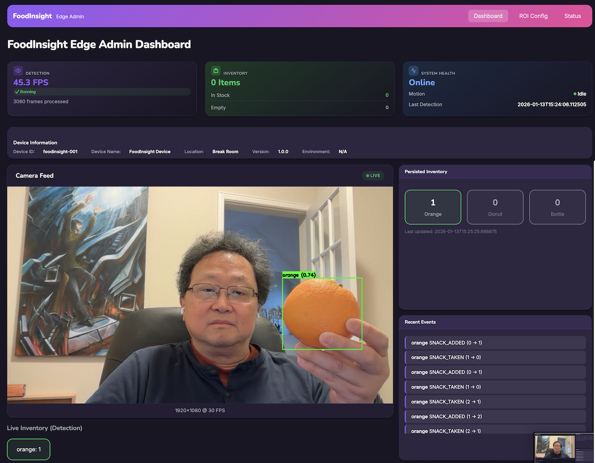
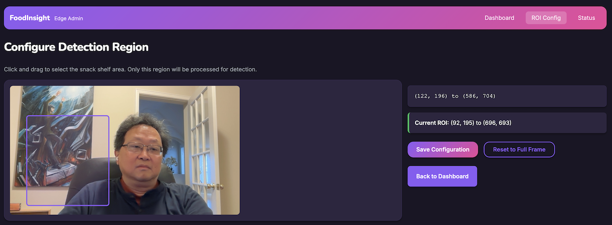
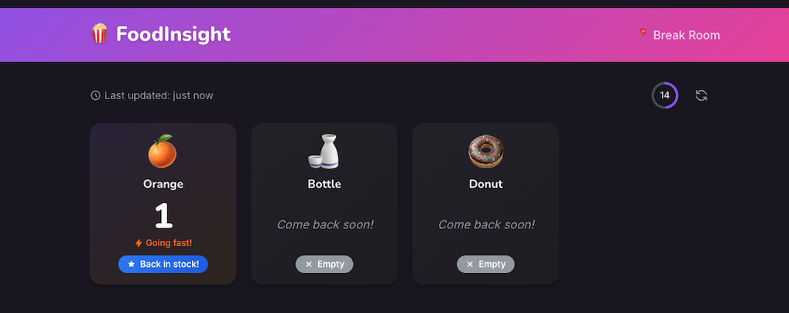
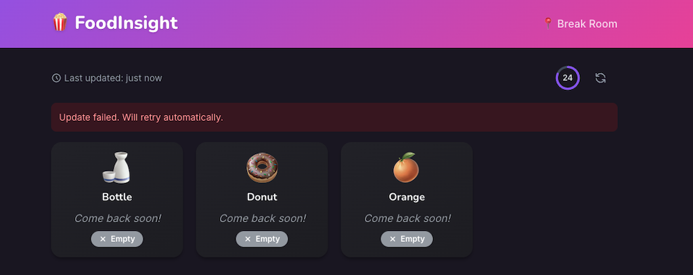

# FoodInsight

Smart food inventory monitoring system using YOLO11 object detection on edge devices.


*Edge AI food detection: A Raspberry Pi camera monitors a dining table, detecting Japanese dishes in real-time with YOLO11. Each dish receives a bounding box and confidence score, all processed locally.*

## Project Status: MVP COMPLETE

All components implemented and tested locally (2026-01-11).

| Component | Location | Status |
|-----------|----------|--------|
| Edge Detection | `detection/`, `admin/`, `privacy/` | Complete |
| Local Backend | `server/` | Complete (SQLite) |
| Consumer PWA | `app/` | Complete |

## Architecture

**Local-First Design**: All data stored locally on the device using SQLite. No cloud dependencies required.


*Local-first architecture: Camera frames flow through motion detection and YOLO11n inference on the edge device. Only inventory deltas (counts, not images) push to the local SQLite backend. The PWA polls for updates.*

## Quick Start (Local Development)

```bash
# 1. Start backend (terminal 1)
cd server
python3 -m venv .venv && source .venv/bin/activate
pip install -e ".[dev]"
uvicorn app.main:app --port 8000 --reload

# 2. Start frontend (terminal 2)
cd app
bun install
bun run dev

# 3. Open http://localhost:5173
```

---

## Edge Device

### Features

- **Real-time Detection**: YOLO11n model optimized for ARM CPU (NCNN format)
- **Object Tracking**: ByteTrack for persistent item IDs across frames
- **Motion-Triggered**: Only runs inference when activity detected
- **Inventory Management**: Tracks item additions and removals
- **Privacy-First**: ROI masking, only metadata sent to backend
- **Admin Portal**: Local web interface for configuration

### Detection Pipeline


*Camera frames at 30 FPS flow through motion detection, which gates expensive YOLO11n inference. Only frames with detected motion proceed to object detection, then ByteTrack for persistence, and finally inventory state management.*

### How It Works


*From unknown to detected: Raw food images pass through YOLO11 to produce labeled detections with confidence scores.*

## Supported Platforms

| Platform | CPU | Expected FPS | Cost | Notes |
|----------|-----|--------------|------|-------|
| Raspberry Pi 4 | Cortex-A72 4x 1.8GHz | 1-3 FPS | $55 | Production (budget) |
| Raspberry Pi 5 | Cortex-A76 4x 2.4GHz | 4-6 FPS | $80 | Production (recommended) |
| macOS / Linux | Any | 10+ FPS | - | Development / testing |

## Quick Start

### Development Testing (Mac/Linux Desktop)

Test the system locally before deploying to Raspberry Pi:

```bash
cd /path/to/foodinsight-edge

# Create virtual environment
python3 -m venv .venv
source .venv/bin/activate

# Install dependencies
pip install ultralytics flask httpx opencv-python numpy

# Run in development mode (port 8080)
python run_dev.py

# Or use a custom config file
python run_dev.py --config custom_config.json
python run_dev.py -c test_config.json
```

Open http://localhost:8080 to access the admin portal.

**Configuration file format (`dev_config.json`):**
```json
{
  "machine_id": "breakroom-1",
  "model_path": "/path/to/models/yolo11n_ncnn_model",
  "input_size": 640,
  "admin_port": 8080,
  "camera_index": 1,
  "api_url": "http://localhost:8000",
  "allowed_classes": ["bottle", "cup", "banana", "apple", "pizza", "donut"]
}
```

Create different config files for different models and class sets (e.g., `food_config.json`, `all_classes_config.json`).

**What works in dev mode:**
- Camera capture via OpenCV (built-in webcam or USB)
- Admin portal with live preview
- ROI configuration UI
- Motion detection
- YOLO inference (if model exported)

**Optional - Enable real detection:**
```bash
# Activate virtual environment first
source .venv/bin/activate

# Export YOLO11n to NCNN format
yolo export model=yolo11n.pt format=ncnn

# Move model to project
mv yolo11n_ncnn_model models/
```

**To stop the server:**
```bash
pkill -f "python run_dev.py"
```

**macOS camera permission:** Grant Terminal/IDE camera access in **System Preferences > Privacy & Security > Camera**.

---

### Custom Model Training & Deployment

Train a custom model on your own dataset (e.g., UECFOOD100 Japanese food) and deploy it:

#### 1. Train the Model

```bash
cd datasets

# Convert dataset to YOLO format (if using UEC FOOD)
python convert_uec_to_yolo.py UECFOOD100 --output UECFOOD100_yolo

# Train on the dataset
python train.py --data UECFOOD100_yolo/data.yaml --epochs 100 --device mps

# Training outputs to: datasets/runs/detect/train/weights/best.pt
```

#### 2. Deploy the Trained Model

After training completes, export and deploy the model:

```bash
cd /path/to/FoodInsight

# Option A: Use the deployment script (recommended)
./scripts/deploy_model.sh datasets/runs/detect/train/weights/best.pt uecfood100

# Option B: Manual steps
cd datasets
python train.py --export runs/detect/train/weights/best.pt --format ncnn
cp -r runs/detect/train/weights/best_ncnn_model ../models/uecfood100_ncnn_model
```

The deployment script:
1. Exports `.pt` model to NCNN format (optimized for CPU/Raspberry Pi)
2. Copies the exported model to `models/` directory
3. Prints usage instructions

#### 3. Create a Config File

Create a config file with your model's class names (see `uecfood100_config.json` as example):

```json
{
  "machine_id": "breakroom-1",
  "model_path": "/path/to/models/uecfood100_ncnn_model",
  "input_size": 640,
  "admin_port": 8080,
  "camera_index": 1,
  "api_url": "http://localhost:8000",
  "allowed_classes": ["rice", "sushi", "ramen noodle", "..."]
}
```

**Important:** The `allowed_classes` must match the class names from your training dataset's `data.yaml`.

#### 4. Run with Custom Model

```bash
# Run detection service with custom model
python run_dev.py --config uecfood100_config.json

# Or start all services
./scripts/start-dev.sh --config uecfood100_config.json
```

#### Model Formats

| Format | Use Case | Size | Speed |
|--------|----------|------|-------|
| `.pt` | Training, validation | Original | GPU optimized |
| NCNN | Raspberry Pi, CPU inference | ~Same | CPU optimized |
| ONNX | Cross-platform, TensorRT | ~Same | Flexible |

For Raspberry Pi deployment, always use NCNN format.

---

### Raspberry Pi Deployment

#### Prerequisites

- Raspberry Pi 4 or 5 (8GB recommended)
- Camera Module 3 or USB camera
- Python 3.11+

#### Installation

```bash
# Clone repository
git clone https://github.com/your-org/foodinsight-edge.git
cd foodinsight-edge

# Create virtual environment
python3 -m venv .venv
source .venv/bin/activate

# Install dependencies
pip install -r requirements.txt

# For Raspberry Pi camera support
pip install picamera2

# Export YOLO11n to NCNN (on dev machine)
yolo export model=yolo11n.pt format=ncnn

# Copy model to device
scp -r yolo11n_ncnn_model/ pi@raspberrypi:/opt/foodinsight/models/
```

### Configuration

```bash
# Copy to deployment location
sudo mkdir -p /opt/foodinsight
sudo cp -r . /opt/foodinsight/
sudo chown -R pi:pi /opt/foodinsight

# Create config file (local SQLite - no cloud credentials needed)
cat > /opt/foodinsight/config.json << EOF
{
  "machine_id": "breakroom-001",
  "model_path": "/opt/foodinsight/models/yolo11n_ncnn_model",
  "api_url": "http://localhost:8000"
}
EOF
```

**Default Admin Credentials**: `admin` / `admin` (change after first login)

### Running

```bash
# Direct execution
python main.py

# Or install as service
sudo cp systemd/foodinsight.service /etc/systemd/system/
sudo systemctl enable foodinsight
sudo systemctl start foodinsight
```

### Admin Portal

Access the admin portal at `http://<device-ip>/`

- View live camera feed with detection overlay
- Configure ROI (Region of Interest)
- Monitor inventory counts
- Check detection FPS and status



*Edge Admin Dashboard: Real-time detection view showing camera feed with YOLO11 bounding boxes, detection status cards (45.3 FPS), device information, persisted inventory counts, and recent events log.*

#### ROI Configuration

Configure the detection region to focus on specific areas:



*ROI Configuration UI: Draw a detection region on the camera snapshot to limit inference to the shelf area. Only objects within the purple boundary will be tracked.*

## Project Structure

```
foodinsight-edge/
├── detection/           # Detection components
│   ├── detector.py      # YOLO11n wrapper
│   ├── tracker.py       # ByteTrack integration
│   ├── motion.py        # Motion detection
│   ├── inventory.py     # State management
│   └── service.py       # Main orchestrator
├── admin/               # Flask admin portal
│   ├── app.py           # Flask application
│   └── templates/       # HTML templates
├── privacy/             # Privacy pipeline
│   └── pipeline.py      # ROI masking
├── api/                 # Cloud API client
│   └── client.py        # HTTP client
├── config/              # Configuration
│   ├── platform.py      # Platform detection
│   └── settings.py      # Settings management
├── tests/               # Unit tests
├── main.py              # Production entry point
├── run_dev.py           # Development runner (Mac/Linux)
└── systemd/             # Service files
```

## Testing

### Development Services

Three services available for local development testing:

| Service | Port | Purpose |
|---------|------|---------|
| FastAPI Backend | 8000 | API server (SQLite) |
| OpenAPI Docs | 8000 | `/docs` (Swagger) or `/redoc` |
| Vue PWA | 5173 | Consumer inventory view |
| Flask Admin | 8080 | Admin/detection portal |

### Consumer PWA



*Consumer PWA showing available inventory: Real-time display of detected items with counts, status badges, and food-specific emoji icons. Green borders indicate items in stock.*



*Consumer PWA with empty inventory: Items marked as "Come back soon!" when out of stock. Each food class displays its corresponding emoji (🍶 Bottle, 🍩 Donut, 🍊 Orange).*

**Start all services:**
```bash
# Default config (dev_config.json)
./scripts/start-dev.sh

# Custom config file
./scripts/start-dev.sh --config custom_config.json
./scripts/start-dev.sh -c food_config.json

# Override camera (env var)
CAMERA_INDEX=0 ./scripts/start-dev.sh
```

**Stop all services:**
```bash
./scripts/stop-dev.sh
```

**Manual start (separate terminals):**
```bash
# Terminal 1: Backend API
cd server && source .venv/bin/activate
uvicorn app.main:app --port 8000

# Terminal 2: Consumer PWA
cd app && bun run dev

# Terminal 3: Detection + Admin Portal
source .venv/bin/activate
CAMERA_INDEX=1 python run_dev.py --config dev_config.json
```

### Unit Tests

Run the test suite:

```bash
# Install dev dependencies
pip install pytest pytest-asyncio

# Run tests
python -m pytest tests/ -v

# Run with coverage
pip install pytest-cov
python -m pytest tests/ --cov=detection --cov=privacy
```

## API Endpoints

### Admin Portal (Flask - Port 80)

| Endpoint | Method | Description |
|----------|--------|-------------|
| `/` | GET | Admin dashboard |
| `/preview` | GET | MJPEG video stream |
| `/status` | GET | JSON status (real-time) |
| `/roi` | GET/POST | ROI configuration |
| `/health` | GET | Health check |
| `/api/inventory-data` | GET | Inventory from backend |
| `/api/events` | GET | Recent detection events |
| `/api/admin/*` | GET/POST | Admin operations (auth required) |

### FastAPI Backend (Port 8000)

| Endpoint | Method | Auth | Description |
|----------|--------|------|-------------|
| `/health` | GET | None | Health check |
| `/ready` | GET | None | Readiness check (DB status) |
| `/info` | GET | None | Device information |
| `/inventory` | GET | None | Current inventory |
| `/inventory/update` | POST | None | Push inventory update |
| `/inventory/event` | POST | None | Log detection event |
| `/inventory/events` | GET | None | Get recent events |
| `/admin/status` | GET | Basic | Device status |
| `/admin/config` | GET/PUT | Basic | Configuration |
| `/admin/users` | GET/POST/DELETE | Basic | User management |
| `/admin/alerts` | GET/POST | Basic | Alert rules |
| `/admin/audit` | GET | Basic | Audit logs |

## Platform Detection

The system auto-detects the platform and applies optimized settings:

| Platform | Input Size | Frame Skip | Motion Threshold |
|----------|------------|------------|------------------|
| RPi 5 | 640×640 | None | 0.02 |
| RPi 4 | 320×320 | Every 3rd | 0.015 |
| Desktop | 640×640 | None | 0.02 |

Platform is detected by reading `/proc/device-tree/model` on Linux. On macOS or unknown platforms, defaults to desktop settings.

---

## Full Project Structure

```
FoodInsight/
├── detection/           # Edge detection components
│   ├── detector.py      # YOLO11n wrapper
│   ├── tracker.py       # ByteTrack integration
│   ├── motion.py        # Motion detection
│   ├── inventory.py     # State management
│   └── service.py       # Main orchestrator
├── admin/               # Flask admin portal
│   ├── app.py           # Flask application (proxies to backend)
│   └── templates/       # HTML templates
├── privacy/             # Privacy pipeline
│   └── pipeline.py      # ROI masking
├── api/                 # Local API client
│   └── client.py        # HTTP client for local backend
├── config/              # Configuration
│   ├── settings.py      # Settings management
│   └── platform.py      # Platform detection
├── server/              # Local backend (FastAPI + SQLite)
│   ├── app/
│   │   ├── main.py      # FastAPI entry point
│   │   ├── config.py    # Pydantic settings
│   │   ├── database.py  # SQLAlchemy engine
│   │   ├── db/
│   │   │   └── models.py  # ORM models
│   │   ├── routers/
│   │   │   ├── health.py    # Health endpoints
│   │   │   ├── inventory.py # Inventory CRUD
│   │   │   └── admin.py     # Admin API (auth required)
│   │   └── services/
│   │       └── sqlite.py    # SQLite service layer
│   └── tests/
├── app/                 # Consumer PWA (Vue 3)
│   ├── src/
│   │   ├── views/
│   │   ├── components/
│   │   ├── stores/
│   │   └── composables/
│   └── vite.config.ts
├── models/              # YOLO model files
├── main.py              # Edge production entry
├── run_dev.py           # Edge development runner
└── README.md
```

## Related Documentation

- [Server README](server/README.md) - FastAPI backend
- [App README](app/README.md) - Vue 3 PWA
- [PRD](docs/FoodInsight%20PRD.md) - Requirements
- [Architecture](docs/FoodInsight%20Solution%20Architecture.md) - Technical design

## Next Steps

1. **Train Custom Model** - Fine-tune YOLO11n on office snack dataset
2. **Field Testing** - Deploy to actual break room
3. **Multi-Device Sync** - Optional cloud sync for multiple devices
4. **Mobile App** - Native app for notifications

## License

MIT
