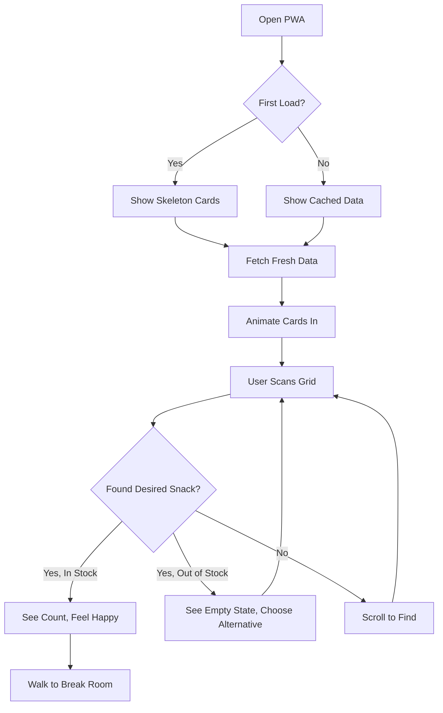
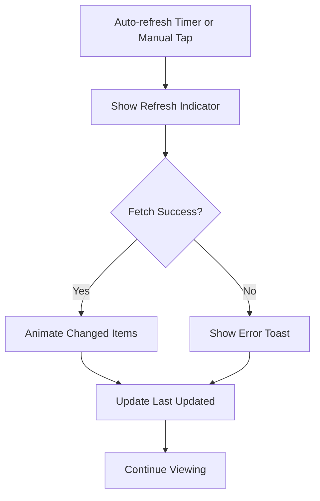
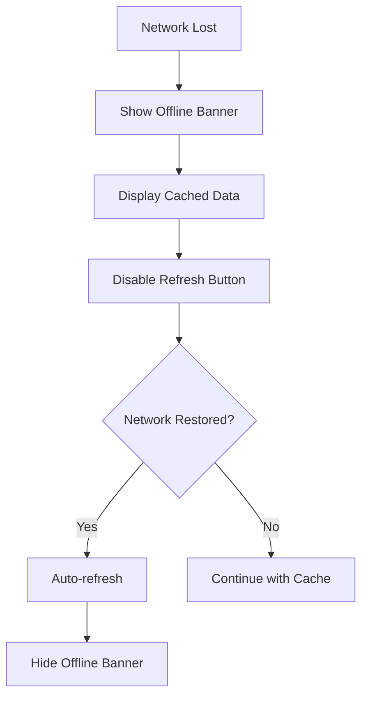

# FoodInsight UX/UI Specification

_Generated on 2026-01-13 by Sally (UX Expert) via BMAD_

## Executive Summary

FoodInsight is a smart snack inventory monitoring PWA that enables office employees to check snack availability before walking to the break room. This UX specification defines a **Playful & Vibrant** visual refresh that transforms the current functional-but-basic interface into an engaging, delightful experience while maintaining the core usability principles from the PRD.

**Design Vision:** A colorful, snack-themed interface that makes checking inventory feel fun and rewarding, with playful animations and vibrant visual feedback that brings the break room experience to users' phones.

---

## 1. UX Goals and Principles

### 1.1 Target User Personas

#### Primary Persona: Alex the Developer

| Attribute | Details |
|-----------|---------|
| **Role** | Software Developer |
| **Goal** | Check what snacks are available before walking to break room |
| **Context** | Quick glance during work, often from phone |
| **Pain Points** | Walking to break room to find favorite snack is out |
| **Success** | Knows exactly what's available in under 5 seconds |

#### Secondary Persona: Office Manager (Future Phase)

| Attribute | Details |
|-----------|---------|
| **Role** | Office Administrator |
| **Goal** | Know when to restock snacks |
| **Context** | Periodic check, may use desktop |
| **Pain Points** | Discovering empty shelves too late |

### 1.2 Usability Goals

| Goal | Target | Metric |
|------|--------|--------|
| **Time to Information** | < 3 seconds | User sees full inventory status |
| **Cognitive Load** | Minimal | No reading required for stock status |
| **Error Prevention** | N/A | Read-only interface |
| **Learnability** | Instant | Zero training required |
| **Accessibility** | WCAG 2.1 AA | Color + icons + text for all status |

### 1.3 Design Principles

| Principle | Description | Application |
|-----------|-------------|-------------|
| **1. Glanceable Joy** | Information should be instantly parseable AND delightful | Large visual indicators, playful colors, animated status |
| **2. Zero Friction** | Remove all barriers to information | No login, no navigation, instant load |
| **3. Snack-Forward** | Celebrate the subject matter | Fun food imagery, appetizing colors, playful icons |
| **4. Trustworthy Data** | Users must trust the information | Clear "last updated" with friendly language, subtle refresh animations |
| **5. Accessible Delight** | Everyone deserves a good experience | Multiple ways to understand status (color + icon + count + text) |

---

## 2. Information Architecture

### 2.1 Site Map

```
FoodInsight PWA
│
├── Main View (/)
│   ├── Header
│   │   ├── Logo + App Name
│   │   └── Location Badge
│   │
│   ├── Status Bar
│   │   ├── Last Updated (friendly time)
│   │   ├── Refresh Countdown
│   │   └── Manual Refresh Button
│   │
│   ├── Snack Grid
│   │   └── Snack Cards (repeated)
│   │       ├── Snack Icon/Image
│   │       ├── Snack Name
│   │       ├── Count Badge
│   │       └── Stock Status
│   │
│   └── Footer
│       └── PWA Install Prompt (contextual)
│
├── Offline State (overlay)
│
└── Update Available (toast)
```

### 2.2 Navigation Structure

**Primary Navigation:** None required - single-view application

**Interaction Points:**
- Pull-to-refresh (mobile)
- Tap refresh button
- PWA install prompt (dismiss or install)

---

## 3. User Flows

### 3.1 Primary Flow: Check Snack Availability



### 3.2 Refresh Flow



### 3.3 Offline Flow



---

## 4. Component Library and Design System

### 4.1 Design System Approach

**Base Framework:** Tailwind CSS v4 (already in use)
**Enhancement:** Custom component layer with playful design tokens
**Icon System:** Custom food-themed icons + emoji fallbacks

### 4.2 Core Components

#### SnackCard Component

| State | Visual Treatment |
|-------|------------------|
| **In Stock (High)** | Vibrant gradient background, bouncy count badge, happy icon |
| **In Stock (Low: 1-3)** | Warm warning gradient, pulse animation on count, "going fast!" indicator |
| **Out of Stock** | Grayscale with sad icon, "come back soon" message, subtle pattern overlay |
| **Loading** | Skeleton with shimmer animation, playful loading shapes |
| **Just Restocked** | Celebration animation, "back in stock!" badge, confetti burst |

**Variants:**

```
┌─────────────────────────┐
│  🍫  ←── Snack Icon     │
│       (large, centered) │
│                         │
│  Candy Bar ←── Name     │
│                         │
│  ┌─────┐                │
│  │  5  │ ←── Count      │
│  └─────┘    (prominent) │
│                         │
│  ✓ In Stock ←── Status  │
│    (with icon)          │
└─────────────────────────┘
```

#### StatusBadge Component

| Status | Color | Icon | Animation |
|--------|-------|------|-----------|
| **Available** | Green gradient (#22c55e → #16a34a) | ✓ Checkmark | Subtle pulse |
| **Low Stock** | Orange gradient (#f97316 → #ea580c) | ⚡ Lightning | Gentle bounce |
| **Out of Stock** | Gray (#9ca3af) | ✗ X mark | None (static) |
| **Just Added** | Blue gradient (#3b82f6 → #2563eb) | ★ Star | Sparkle |

#### RefreshIndicator Component

| State | Visual |
|-------|--------|
| **Idle** | Circular progress showing countdown |
| **Refreshing** | Spinning animation with snack icons |
| **Success** | Green checkmark flash |
| **Error** | Red shake with retry prompt |

#### OfflineBanner Component

- Warm yellow background (#fef3c7)
- Cloud-offline icon
- Friendly message: "You're offline - showing last known snacks"
- Subtle pattern overlay

---

## 5. Visual Design Foundation

### 5.1 Color Palette

#### Primary Colors

| Name | Hex | Usage |
|------|-----|-------|
| **Snack Purple** | #8b5cf6 | Primary brand, header gradient start |
| **Candy Pink** | #ec4899 | Primary brand, header gradient end |
| **Fresh Green** | #22c55e | In-stock status, success states |
| **Warning Orange** | #f97316 | Low stock alerts |
| **Empty Gray** | #9ca3af | Out of stock items |

#### Background Gradients

| Name | Gradient | Usage |
|------|----------|-------|
| **Header Gradient** | `linear-gradient(135deg, #8b5cf6 0%, #ec4899 100%)` | App header |
| **Card Available** | `linear-gradient(145deg, #faf5ff 0%, #f0fdf4 100%)` | In-stock cards |
| **Card Warning** | `linear-gradient(145deg, #fffbeb 0%, #fff7ed 100%)` | Low-stock cards |
| **Card Empty** | `linear-gradient(145deg, #f9fafb 0%, #f3f4f6 100%)` | Out-of-stock cards |

#### Semantic Colors

| Purpose | Light Mode | Dark Mode |
|---------|------------|-----------|
| **Background** | #faf5ff (soft purple tint) | #1a1625 |
| **Card Background** | #ffffff | #2d2640 |
| **Text Primary** | #1f2937 | #f9fafb |
| **Text Secondary** | #6b7280 | #9ca3af |

### 5.2 Typography

**Font Families:**

| Role | Font | Fallback |
|------|------|----------|
| **Display** | Nunito | system-ui, sans-serif |
| **Body** | Inter | system-ui, sans-serif |
| **Mono** | JetBrains Mono | monospace |

**Type Scale:**

| Name | Size | Weight | Line Height | Usage |
|------|------|--------|-------------|-------|
| **App Title** | 28px | 800 | 1.2 | Header title |
| **Card Title** | 16px | 600 | 1.4 | Snack names |
| **Count Display** | 48px | 800 | 1.0 | Stock count numbers |
| **Status Text** | 12px | 500 | 1.5 | Status badges |
| **Meta Text** | 11px | 400 | 1.5 | Last updated, location |

### 5.3 Spacing and Layout

**Base Unit:** 4px

| Token | Value | Usage |
|-------|-------|-------|
| **xs** | 4px | Icon padding, tight gaps |
| **sm** | 8px | Badge padding, small gaps |
| **md** | 16px | Card padding, standard gaps |
| **lg** | 24px | Section spacing |
| **xl** | 32px | Major section breaks |

**Grid System:**

| Breakpoint | Columns | Card Width | Gap |
|------------|---------|------------|-----|
| **Mobile (< 640px)** | 2 | ~45% | 12px |
| **Tablet (640-1024px)** | 3 | ~30% | 16px |
| **Desktop (> 1024px)** | 4 | ~23% | 20px |

**Card Dimensions:**

| Property | Value |
|----------|-------|
| **Min Height** | 160px |
| **Border Radius** | 16px |
| **Shadow** | `0 4px 6px -1px rgba(139, 92, 246, 0.1), 0 2px 4px -1px rgba(139, 92, 246, 0.06)` |

---

## 6. Responsive Design

### 6.1 Breakpoints

| Name | Min Width | Behavior |
|------|-----------|----------|
| **Mobile** | 0px | 2-column grid, stacked header |
| **Tablet** | 640px | 3-column grid, inline header |
| **Desktop** | 1024px | 4-column grid, max-width container |

### 6.2 Adaptation Patterns

#### Header Adaptation

| Mobile | Tablet/Desktop |
|--------|----------------|
| Full-width gradient | Rounded with margin |
| Stacked: Title above location | Inline: Title + location |
| Larger touch targets | Standard sizing |

#### Card Grid Adaptation

| Mobile | Tablet | Desktop |
|--------|--------|---------|
| 2 columns | 3 columns | 4 columns |
| Tighter gaps (12px) | Medium gaps (16px) | Larger gaps (20px) |
| Full swipe area | Standard cards | Hover states |

#### Refresh Controls

| Mobile | Desktop |
|--------|---------|
| Pull-to-refresh enabled | Pull-to-refresh disabled |
| Floating refresh button | Inline refresh button |
| Haptic feedback on refresh | No haptics |

---

## 7. Accessibility

### 7.1 Compliance Target

**WCAG 2.1 Level AA** - Required for inclusive internal tool

### 7.2 Key Requirements

| Requirement | Implementation |
|-------------|----------------|
| **Color Contrast** | All text meets 4.5:1 ratio minimum |
| **Non-color Indicators** | Stock status uses color + icon + text |
| **Focus Indicators** | Visible focus ring on interactive elements |
| **Screen Reader** | Semantic HTML, ARIA labels for status |
| **Motion Sensitivity** | Respect `prefers-reduced-motion` |
| **Touch Targets** | Minimum 44x44px for all interactive elements |

**Status Communication:**

| Status | Color | Icon | Text | ARIA |
|--------|-------|------|------|------|
| **In Stock** | Green | ✓ | "Available" | "5 items available" |
| **Low Stock** | Orange | ⚡ | "Low" | "Only 2 items left" |
| **Out of Stock** | Gray | ✗ | "Empty" | "Out of stock" |

---

## 8. Interaction and Motion

### 8.1 Motion Principles

| Principle | Description |
|-----------|-------------|
| **Purposeful** | Every animation communicates meaning |
| **Quick** | Animations under 300ms feel responsive |
| **Playful but not Distracting** | Fun on first view, subtle on repeat |
| **Respects Preferences** | Reduced motion users see no animations |

**Timing Standards:**

| Type | Duration | Easing |
|------|----------|--------|
| **Micro-interactions** | 150-200ms | ease-out |
| **State Changes** | 200-300ms | ease-in-out |
| **Loading Transitions** | 300-500ms | ease-out |
| **Celebrations** | 600-800ms | spring |

### 8.2 Key Animations

#### Card Load Animation

```css
/* Staggered entry with playful bounce */
@keyframes cardEnter {
  0% {
    opacity: 0;
    transform: translateY(20px) scale(0.95);
  }
  70% {
    transform: translateY(-5px) scale(1.02);
  }
  100% {
    opacity: 1;
    transform: translateY(0) scale(1);
  }
}
```

#### Count Change Animation

```css
/* Number flip with color flash */
@keyframes countChange {
  0% {
    transform: scale(1);
  }
  50% {
    transform: scale(1.2);
    color: var(--accent-color);
  }
  100% {
    transform: scale(1);
  }
}
```

#### Low Stock Pulse

```css
/* Gentle attention-drawing pulse */
@keyframes lowStockPulse {
  0%, 100% {
    box-shadow: 0 0 0 0 rgba(249, 115, 22, 0.4);
  }
  50% {
    box-shadow: 0 0 0 8px rgba(249, 115, 22, 0);
  }
}
```

#### Refresh Spin

```css
/* Fun snack-themed refresh */
@keyframes refreshSpin {
  0% {
    transform: rotate(0deg);
  }
  100% {
    transform: rotate(360deg);
  }
}
```

#### Out of Stock Shake (on first view)

```css
/* Playful "sorry!" shake */
@keyframes emptyShake {
  0%, 100% { transform: translateX(0); }
  25% { transform: translateX(-4px); }
  75% { transform: translateX(4px); }
}
```

---

## 9. Design Files and Wireframes

### 9.1 Design Files

| Deliverable | Location | Status |
|-------------|----------|--------|
| **Figma Components** | TBD | To be created |
| **Icon Set** | `/app/src/assets/icons/` | To be created |
| **Animation Specs** | This document | Complete |

### 9.2 Key Screen Layouts

#### Main View - Mobile (375px)

```
┌─────────────────────────────────┐
│ ████████████████████████████████ │ ← Header gradient
│                                 │
│   🍿 FoodInsight               │ ← Logo + Title
│   📍 Break Room                │ ← Location
│                                 │
├─────────────────────────────────┤
│ Updated just now    ○ 28s  🔄  │ ← Status bar
├─────────────────────────────────┤
│                                 │
│  ┌───────────┐ ┌───────────┐   │
│  │    🥔     │ │    🍫     │   │
│  │           │ │           │   │
│  │  Chips    │ │ Candy Bar │   │
│  │           │ │           │   │
│  │ ┌──────┐  │ │ ┌──────┐  │   │
│  │ │  5   │  │ │ │  12  │  │   │
│  │ └──────┘  │ │ └──────┘  │   │
│  │ ✓ In Stock│ │ ✓ In Stock│   │
│  └───────────┘ └───────────┘   │
│                                 │
│  ┌───────────┐ ┌───────────┐   │
│  │    🥤     │ │    🍪     │   │
│  │           │ │   ░░░░    │   │ ← Out of stock (dimmed)
│  │   Soda    │ │  Cookies  │   │
│  │           │ │           │   │
│  │ ┌──────┐  │ │ ┌──────┐  │   │
│  │ │  2   │  │ │ │  0   │  │   │
│  │ └──────┘  │ │ └──────┘  │   │
│  │ ⚡ Low    │ │ ✗ Empty   │   │ ← Low stock warning
│  └───────────┘ └───────────┘   │
│                                 │
└─────────────────────────────────┘
```

#### Main View - Desktop (1280px)

```
┌─────────────────────────────────────────────────────────────────────────┐
│                                                                         │
│    ┌─────────────────────────────────────────────────────────────┐     │
│    │ ████████████████████████████████████████████████████████████│     │
│    │                                                              │     │
│    │   🍿 FoodInsight            📍 Break Room                   │     │
│    │                                                              │     │
│    └─────────────────────────────────────────────────────────────┘     │
│                                                                         │
│    Updated just now                                    ○ 25s  🔄       │
│                                                                         │
│    ┌─────────┐ ┌─────────┐ ┌─────────┐ ┌─────────┐                     │
│    │   🥔    │ │   🍫    │ │   🥤    │ │   🍪    │                     │
│    │         │ │         │ │         │ │  ░░░░   │                     │
│    │  Chips  │ │  Candy  │ │  Soda   │ │ Cookies │                     │
│    │         │ │   Bar   │ │         │ │         │                     │
│    │ ┌─────┐ │ │ ┌─────┐ │ │ ┌─────┐ │ │ ┌─────┐ │                     │
│    │ │  5  │ │ │ │ 12  │ │ │ │  2  │ │ │ │  0  │ │                     │
│    │ └─────┘ │ │ └─────┘ │ │ └─────┘ │ │ └─────┘ │                     │
│    │✓ Stock  │ │✓ Stock  │ │⚡ Low   │ │✗ Empty  │                     │
│    └─────────┘ └─────────┘ └─────────┘ └─────────┘                     │
│                                                                         │
│    ┌─────────┐ ┌─────────┐ ┌─────────┐ ┌─────────┐                     │
│    │   🍎    │ │   🍌    │ │   💧    │ │   ⚡    │                     │
│    │  Apple  │ │ Banana  │ │  Water  │ │ Energy  │                     │
│    │ ┌─────┐ │ │ ┌─────┐ │ │ ┌─────┐ │ │ ┌─────┐ │                     │
│    │ │  8  │ │ │ │  6  │ │ │ │ 15  │ │ │ │  4  │ │                     │
│    │ └─────┘ │ │ └─────┘ │ │ └─────┘ │ │ └─────┘ │                     │
│    │✓ Stock  │ │✓ Stock  │ │✓ Stock  │ │✓ Stock  │                     │
│    └─────────┘ └─────────┘ └─────────┘ └─────────┘                     │
│                                                                         │
└─────────────────────────────────────────────────────────────────────────┘
```

#### Offline State

```
┌─────────────────────────────────┐
│ ⚠️ You're offline               │ ← Yellow banner
│ Showing last known snacks       │
├─────────────────────────────────┤
│                                 │
│  (Normal grid with cached data) │
│  (Refresh button disabled)      │
│                                 │
└─────────────────────────────────┘
```

---

## 10. Next Steps

### 10.1 Immediate Actions

| Priority | Action | Owner | Notes |
|----------|--------|-------|-------|
| **P0** | Create Tailwind design tokens | Dev | Colors, typography, spacing |
| **P0** | Update SnackCard component | Dev | New gradients, animations |
| **P1** | Add custom snack icons | Design | SVG or emoji expansion |
| **P1** | Implement header gradient | Dev | With dark mode support |
| **P2** | Add micro-animations | Dev | Card entry, count change |
| **P2** | Add pull-to-refresh | Dev | Mobile gesture |
| **P3** | Create celebration animation | Dev | For "back in stock" |

### 10.2 Design Handoff Checklist

#### Requirements Coverage

- [x] All user flows documented
- [x] Component inventory complete
- [x] Accessibility requirements defined
- [x] Responsive strategy clear
- [x] Animation specifications defined
- [x] Color palette with dark mode
- [x] Typography system defined

#### Implementation Ready

- [x] Design tokens extractable
- [x] Component states defined
- [x] Mobile-first approach documented
- [x] Performance considerations noted (reduced motion)

#### Quality Gates

- [ ] Figma designs created (optional - can implement from spec)
- [x] Developer handoff document complete
- [x] Accessibility audit criteria defined

---

## 11. Implementation Priorities

### Phase 1: Foundation (MVP Refresh)

1. **Design Tokens** - Update Tailwind config with new color palette
2. **Card Redesign** - Implement new SnackCard with gradients and states
3. **Header Update** - Gradient header with logo/location
4. **Status Indicators** - Color + icon + text for all states

### Phase 2: Delight

1. **Animations** - Card entry, count change, refresh
2. **Low Stock Warning** - Pulse effect, "going fast" indicator
3. **Pull-to-Refresh** - Mobile gesture support

### Phase 3: Polish

1. **Dark Mode** - Full dark mode support
2. **Celebration Effects** - "Back in stock" animation
3. **Custom Icons** - Replace emoji with custom SVG icons

---

## Appendix

### Related Documents

- PRD: `/Users/bcheung/dev/KnowledgeBase/Projects/FoodInsight/FoodInsight PRD.md`
- Architecture: `/Users/bcheung/dev/KnowledgeBase/Projects/FoodInsight/FoodInsight Solution Architecture.md`
- Implementation: `/Users/bcheung/dev/FoodInsight/app/`

### Current vs Proposed Comparison

| Aspect | Current | Proposed |
|--------|---------|----------|
| **Header** | Plain white, simple text | Gradient purple-pink, branded |
| **Cards** | White with gray border | Gradient backgrounds per state |
| **Icons** | Basic emoji | Large, centered emoji/custom icons |
| **Count Display** | Medium text | Large, bold, prominent |
| **Status** | Small badge | Color + icon + text, larger |
| **Animations** | Spin on refresh only | Entry, count change, pulse, shake |
| **Colors** | Gray/white/green | Vibrant purple, pink, green, orange |

### Version History

| Date | Version | Changes | Author |
|------|---------|---------|--------|
| 2026-01-13 | 1.0 | Initial UX specification for refresh | Sally (UX Expert) via BMAD |

---

_This UX specification was created using the BMAD UX Spec workflow. The Playful & Vibrant direction was selected to create an engaging break room experience that makes checking snack availability fun and rewarding._
